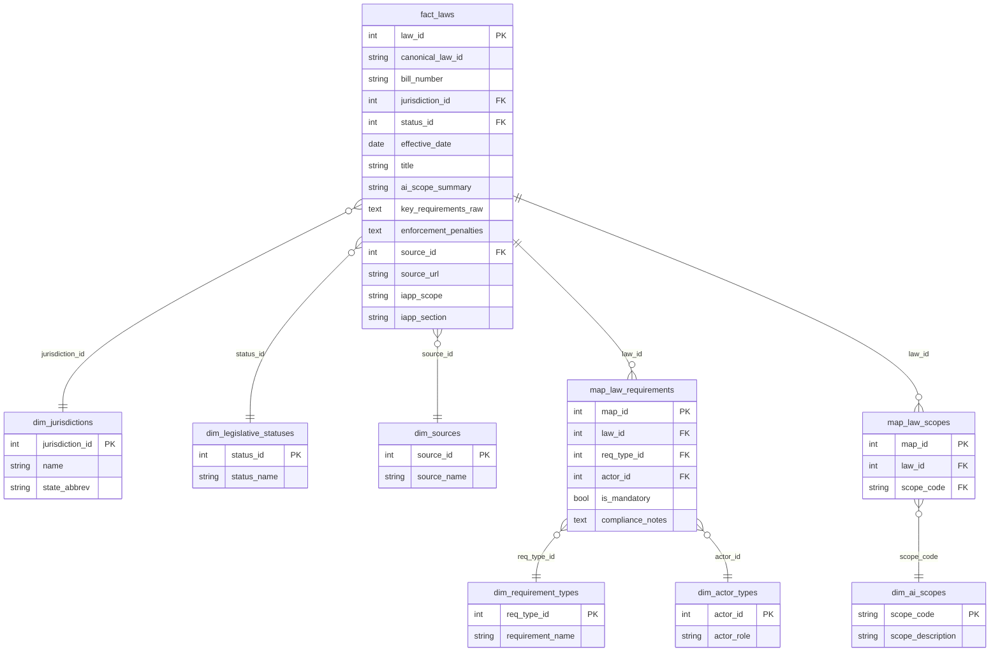

# Regs Checker — Data & Taxonomy Reference

**Audience:** Business, product, and review teams (no engineering background assumed)
**Purpose:** Explains, in plain English, every field the pipeline extracts from each
law and how the current taxonomy is organized.
**Authoritative law count:** 232 (`data/fact_laws.csv`)

---

## Contents

1. [The big picture](#1-the-big-picture)
2. [Law-level fields](#2-law-level-fields)
3. [Clause-level fields (the detailed extractions)](#3-clause-level-fields-the-detailed-extractions)
4. [The current taxonomy (controlled vocabularies)](#4-the-current-taxonomy-controlled-vocabularies)
5. [How data quality is graded (the trust layer)](#5-how-data-quality-is-graded-the-trust-layer)
6. [Where the taxonomy is heading](#6-where-the-taxonomy-is-heading)
7. [Appendix — Taxonomy chart (for a legal data scientist)](#7-appendix--taxonomy-chart-for-a-legal-data-scientist)

---

## 1. The big picture

Regs Checker reads the **full text of ~232 US state and federal AI laws** and turns
each one into **structured, queryable data** — so that instead of a lawyer reading a
40-page bill, a business can ask *"Does this law apply to me? What do I have to do?
By when? What happens if I don't?"* and get a precise answer.

It captures data at **two levels**:

| Level | Question it answers | How it's produced |
|---|---|---|
| **Law-level** (one record per law) | "What is this law, who does it cover, what's the penalty, when's the deadline?" | 3 AI agents that read the *whole bill* at once |
| **Clause-level** (many records per law) | "What exactly does *this sentence* require, and of whom?" | 6 AI agents that read the bill *passage by passage* |

Every extracted fact is tied back to a **verbatim quote** from the law (the "evidence
span") and graded for **trustworthiness** (a confidence tier from A to D). Nothing is
taken on faith.

---

## 2. Law-level fields

These are the headline facts held for each law — exported per-law to `output/laws.json`.
They come partly from source metadata (Orrick law-firm tracker + IAPP) and partly from the
three whole-bill AI agents. *(A consumer-facing "Law Card" UI built on this data is
planned, not yet built — see Section 6.)*

### 2a. Basic identity & status

| Field | Plain-English meaning | Example |
|---|---|---|
| **Title** | The law's name | "Colorado AI Act (SB 205)" |
| **Bill number** | Official legislative number | "SB 205" |
| **Jurisdiction** | Which state / body | "Colorado", "California", "EU" |
| **Status** | Where it is in its lifecycle | *Proposed* → *Passed, not yet in effect* → *In effect* |
| **Effective date** | When it becomes (or became) law | 2026-02-01 |
| **AI scope summary** | One-line topic | "Automated decision-making in employment" |
| **Source** | Where we sourced the law | Orrick, IAPP |

### 2b. "Who does this law apply to?" — *Applicability Agent*

The engine behind the **"does this apply to me?"** matching. Reads the whole bill and
answers:

| Field | Plain-English meaning | Example values |
|---|---|---|
| **Covered entity types** | The kinds of businesses regulated | developer, deployer, provider, employer, state agency |
| **Covered sectors** | Industries in scope | employment, healthcare, credit, housing, insurance, criminal justice |
| **AI system types in scope** | What kinds of AI are regulated | high-risk AI, automated decision systems, generative AI, facial recognition |
| **Size thresholds** | The "you're big enough to be covered" triggers | revenue ≥ $25M; ≥ 50 employees; data on ≥ 100k consumers; compute ≥ 10²⁶ FLOPS |
| **Geographic scope** | Where it reaches | "entities doing business in Colorado" |
| **Key exemptions** | Who's carved out | "small businesses under 50 employees", "HIPAA-covered entities" |
| **Government only?** | Applies only to the public sector? | true / false |
| **Applicability summary** | Plain-language "who's covered" | "Applies to businesses deploying AI for hiring decisions in CA." |

### 2c. "What happens if I don't comply?" — *Enforcement Agent*

| Field | Plain-English meaning | Example |
|---|---|---|
| **Enforcing body** | Who comes after you | "Attorney General" |
| **Max civil penalty (USD)** | Biggest fine per violation | $20,000 |
| **Penalty per** | The unit fines are counted in | per violation / per day / per occurrence |
| **Cure period (days)** | Grace period to fix it before penalties | 60 days |
| **Private right of action** | Can individuals sue you directly? | true / false |
| **Criminal penalties** | Possible jail time / criminal fines? | true / false |
| **Criminal penalty description** | Detail of any criminal penalties | "Class 1 misdemeanor; up to 1 year" |
| **Enforcement text** | Verbatim quote describing the enforcement mechanism | "…shall be enforced by the attorney general…" |

### 2d. "When are the deadlines?" — *Compliance Timeline Agent*

| Field | Plain-English meaning | Example |
|---|---|---|
| **Law effective date** | When the law switches on | 2026-02-01 |
| **Enforcement start date** | When they actually start penalizing | 2026-08-01 |
| **Sunset date** | When the law expires (if ever) | — |
| **Key deadlines** | List of dated actions, each with: action, deadline type (before-deployment / after-enactment / recurring / event-triggered / one-time), relative days, recurrence months, trigger event | "Complete impact assessment 90 days before deployment" |
| **Assessment frequency** | How often you must re-do assessments | every 12 months |
| **Consumer response window** | Days to respond to a consumer request | 45 days |
| **First compliance action** | The first thing you must do, and when | "Register the system with the AG before launch." |

---

## 3. Clause-level fields (the detailed extractions)

These six agents read the law **passage by passage**, producing many records per law.
This is the granular layer that powers detailed obligation tracking and cross-state
comparison.

> **Stored with every extraction record (all 9 agents, bill- and clause-level).** Each
> record also carries: **evidence spans** (verbatim backing quotes, each with a *verified*
> flag + character offsets), a **confidence score + tier** (A–D, Section 5), a **review
> status** (pending / approved / rejected / needs-revision), the **model + prompt version**
> used, and a deterministic **plain-English summary** for reviewers.

### 3a. "Who must do what?" — *Obligation Agent* (the richest extractor)

| Field | Plain-English meaning | Example |
|---|---|---|
| **Subject** / **Subject (normalized)** | Who must comply (raw + standardized) | "a deployer of a high-risk system" → **deployer** |
| **Modality** | The strength of the duty | must / shall / may / prohibited |
| **Action** | What they must do (or not do) | "conduct an impact assessment" |
| **Object** | What the action applies to | "the automated decision system" |
| **Condition** | The trigger | "before deploying the system" |
| **Timeline** | Dates attached to this duty | deadline, phase-in period, sunset |
| **Enforcement** | Penalty attached to this duty | body, penalty type, max fine, cure period, can-be-sued flag |
| **Preemption signals** | Verbatim federal/state preemption language found in the clause | "this section does not preempt federal law" |
| **Section reference** | Where in the law this clause sits | "§ 6-1-1702(3)(a)" |
| **Jurisdiction** | Jurisdiction code if stated in the clause | "CO" |
| **Safe harbor** | A "get-out-of-jail" path | "Following NIST AI RMF = affirmative defense" |
| **Consent requirements** | Required notice/consent | type (opt-in/opt-out), timing, method |
| **Interpretation risks** | Vague/ambiguous language flagged for review | "'reasonable care' is undefined" (severity: high) |

### 3b. "Who is protected, and what can they demand?" — *Rights & Protections Agent*

The flip side of obligations — what *individuals* are entitled to.

| Field | Plain-English meaning | Example |
|---|---|---|
| **Right holder** | Who holds the right | consumer, employee, job applicant, patient |
| **Right holder (normalized)** | Standardized holder category | consumer / employee / public |
| **Protected categories** | Explicitly protected groups | minor, tenant, borrower, student |
| **Right type** | The kind of right | notice, explanation, opt-out, appeal, deletion, human review |
| **Right description** | What they're entitled to | "right to a human review of an adverse AI decision" |
| **Trigger condition** | When the right kicks in | "upon an adverse hiring decision" |
| **Duty bearer** | Who must honor it | the employer / deployer |
| **Remedies** | Recourse if violated | complaint, damages, deletion — plus time limits |
| **Section reference / Jurisdiction** | Where in the law, and jurisdiction code | "§ 22-...", "CA" |
| **Interpretation risks** | Same ambiguity flags as obligations (vague terms, undefined refs) | "'meaningful human review' is undefined" |

### 3c. "How do I prove compliance?" — *Compliance Mechanism Agent*

The procedural machinery: audits, assessments, reporting, recordkeeping.

| Field | Plain-English meaning | Example |
|---|---|---|
| **Mechanism type** | The procedural requirement | impact assessment, bias audit, registration, certification, reporting |
| **Responsible party** | Who performs it | developer / deployer |
| **Responsible party (normalized)** | Standardized category | developer / deployer / operator / vendor |
| **Audits** | Audit details | type, frequency, who audits, who sees results, public? |
| **Record retention** | How long to keep records | 36 months — and *what* to keep |
| **Assessment frequency** | How often impact assessments must be renewed (months) | 12 (annual) |
| **Reporting** | Filing cadence + recipient | annual report to the AG |
| **Classification flags** | Quick yes/no tags | is bias testing? / is red-teaming? / is third-party audit? |
| **Incident reporting window** | Hours to report an incident | 72 hours |
| **NIST references** | Links to NIST AI framework controls | "MEASURE-2.1" |
| **Section reference / Jurisdiction** | Where in the law, and jurisdiction code | "§ 1798.185", "CA" |

### 3d. "When does it apply / when am I exempt?" — *Threshold & Exception Agent*

| Field | Plain-English meaning | Example |
|---|---|---|
| **Threshold sub-type** | The kind of boundary | scope (who/what), temporal (deadlines), exemption (carve-outs) |
| **Threshold type** | The specific type within the sub-type | numeric / monetary / date / compute / entity_type / sector / safe_harbor |
| **Threshold value / unit / condition** | The actual trigger | "$25,000,000 annual revenue" |
| **Applies to obligation** | Which obligation this boundary modifies | "the impact-assessment duty" |
| **Revenue / employee / consumer-data thresholds** | Typed numeric triggers | ≥ $25M / ≥ 50 / ≥ 100k |
| **Compute threshold (FLOPS) + description** | Frontier-model size trigger, numeric + readable | 10²⁶ — "models trained above 10^26 FLOPS" |
| **Sector applicability** | Which consequential-decision sectors | healthcare, employment, credit |
| **Exceptions** | Carve-outs and safe harbors | "research use is exempt" |

### 3e. "What do the words mean?" — *Definition & Actor Agent*

| Field | Plain-English meaning | Example |
|---|---|---|
| **Term** + **Definition text** | A defined term and its full legal definition | "'Algorithmic discrimination' means…" |
| **Scope** | Where the definition applies | "for purposes of this article" |
| **Cross-references** | Other sections that reference this term | "§ 2, § 7(b)" |
| **Actors** | Roles named, and their responsibilities | developer, deployer, regulator |
| **Framework references** | External standards the law leans on | "incorporates NIST AI RMF" |

### 3f. "Does this conflict with other laws?" — *Preemption Agent*

| Field | Plain-English meaning | Example |
|---|---|---|
| **Conflict type** | The kind of legal tension | federal preemption, cross-state conflict, First Amendment |
| **Description** | Plain-language conflict summary | "May be preempted by federal AI executive order" |
| **Related authority** | The competing law/authority | "Dec 2025 Federal EO on AI" |
| **Severity** | Risk level | high / medium / low |
| **Preemption language** | Verbatim preemption clause from the passage | "nothing in this section shall preempt federal law" |
| **Cross-law references** | Other laws this one points to | supersedes / incorporates / conflicts-with |
| **Section reference / Jurisdiction** | Where in the law, and jurisdiction code | "§ 4", "TX" |

---

## 4. The current taxonomy (controlled vocabularies)

The taxonomy is the set of **standardized labels** that make the data filterable and
comparable across states. Without it, "deployer," "Deployer," and "entity that
deploys" would all be different — and filtering would break. Today the taxonomy lives
in a handful of **dimension tables** (the "approved value lists") plus **mapping
tables** (which law has which labels).

### Dimension tables (the approved value lists)

| Taxonomy | Approved values | Purpose |
|---|---|---|
| **Jurisdictions** | 49 entries — all US states + EU | Filter by location |
| **Actor types** | Deployer, Developer, Provider, Distributor | Who the law regulates |
| **Requirement types** | 12 values: Governance Program, Assessments, Training, Responsible Individual, General Notice, Labeling/Notification, Explanation/Incident Reporting, Provider Documentation, Registration, Third-party Review, Opt-out/Appeal, Nondiscrimination | The category of obligation |
| **AI scopes** | A = all AI systems · F = foundation/frontier models · D = automated decision-making · G = generative AI · \* = AI trained on personal data | What kind of AI is covered |
| **Legislative statuses** | Active, Enacted, Failed/Dead, Signed | Lifecycle stage |
| **Sources** | Orrick, IAPP | Where the law data came from |

### Mapping tables (which law has which labels)

- **Law → Requirements** — links each law to its requirement types *and* the
  responsible actor, with a mandatory-or-not flag.
- **Law → AI scopes** — links each law to its scope code(s).

### Tag categories (the search/filter facets in the `laws.json` export)

The user-facing export also groups tags into facets: **jurisdiction, source, lifecycle
status, AI scope, AI topic, concept, compliance requirement, regulated actor** — e.g.
concepts like *children, employment, intimate images, political advertising,
transparency*.

---

## 5. How data quality is graded (the trust layer)

Because the data is AI-extracted, every record carries a **confidence tier** so
reviewers and downstream products know how much to trust it. The score blends six
signals — most heavily, **agreement with Orrick law-firm reference data (30%)** and
**independent re-checking (25%)**.

| Tier | Score | What it means for the business |
|---|---|---|
| **A** | ≥ 0.85 | High confidence — candidate for auto-approval |
| **B** | ≥ 0.70 | Solid — standard review |
| **C** | ≥ 0.50 | Needs a careful human look |
| **D** | < 0.50 | Requires human review |

**The key rule (the "Orrick gate"):** any extraction *without* law-firm reference data
to validate against is automatically **Tier D**, no matter how good it looks. This is
the guardrail that keeps unvalidated AI output from reaching production.

---

## 6. Where the taxonomy is heading

The taxonomy is mid-redesign. The strategy work underway expands it toward richer,
profile-matched dimensions — `covered_sectors`, a two-level `obligation_type`,
`harm_categories` (discrimination, privacy, deception, safety, child, election…), and
split status fields (signed vs. actually-in-effect). The redesign principle is
*additive* — old labels stay until new ones are validated.

If the business team will rely on these filters, it's worth knowing which dimensions
are **live today** (Section 4) vs. **planned**. See `docs/taxonomy_strategy_summary.md`
and `docs/taxonomy_dev_plan.md` for the full redesign plan, and
`docs/pipeline_rebuild_plan.md` for the alternative ground-up approach.

---

## 7. Appendix — Taxonomy chart (for a legal data scientist)

> This section is the schema-accurate companion to Section 4. It enumerates every
> controlled vocabulary *as it actually exists in the code today*, with its **enforcement
> level** and **join keys**, so the data can be queried and trusted appropriately.

The "taxonomy" is not one thing — it lives in **three coexisting layers** with very
different reliability guarantees:

| Layer | What it classifies | Where it lives | Enforcement |
|---|---|---|---|
| **L1 — Curated law-metadata star schema** | Whole **laws** | `data/*.csv` → seeded to Postgres/Supabase | **Hard** — PK/FK, hand-curated |
| **L2 — Operational Postgres enums** | Pipeline state + extraction record type | DB `CREATE TYPE` enums | **Hard** — DB-rejected if off-list |
| **L3 — Extraction vocabularies** | The **obligations/rights/etc. inside** laws | Agent prompts + Pydantic schemas | **Advisory** — LLM-emitted, mostly unvalidated |

The single most important fact for analysis: **L3 is almost entirely advisory.** Agents
are *instructed* to emit values from a list, but the Pydantic schemas type these as plain
`str` — so off-vocab values pass validation and land in `payload` JSONB unchanged. Only
two L3 fields are schema-enforced (`Literal`-typed). This gap is the reason the
normalization stage in the taxonomy redesign exists.

### 7.1 L1 — Curated law-metadata star schema

- **Grain:** `fact_laws` = 1 row per law (**232 rows**). `map_law_requirements` = 1 row per
  **(law × requirement_type × actor)** with an `is_mandatory` flag — a single law typically
  has many rows. `map_law_scopes` = 1 row per **(law × scope_code)**.
- **Snowflake note:** `map_law_requirements` is a *bridge with an attribute* (`is_mandatory`),
  joining the fact to **two** dimensions at once (requirement + actor).

### 7.2 L1 — Controlled vocabularies (exact values)

| Dimension table | Grain / PK | Values (verbatim) | Rows |
|---|---|---|---|
| `dim_jurisdictions` | `jurisdiction_id` | 48 US states + `European Union` | **49** |
| `dim_legislative_statuses` | `status_id` | `Active`, `Enacted`, `Failed/Dead`, `Signed` | 4 |
| `dim_sources` | `source_id` | `Orrick`, `IAPP` | 2 |
| `dim_actor_types` | `actor_id` | `Deployer`, `Developer`, `Provider`, `Distributor` | 4 |
| `dim_requirement_types` | `req_type_id` | `Governance Program`, `Assessments`, `Training`, `Responsible Individual`, `General Notice`, `Labeling/Notification`, `Explanation/Incident Reporting`, `Provider Documentation`, `Registration`, `Third-party Review`, `Opt-out/Appeal`, `Nondiscrimination` | 12 |
| `dim_ai_scopes` | `scope_code` | `A` = all covered AI · `F` = foundation/frontier/general-purpose · `D` = automated decision-making · `G` = generative/synthetic · `*` = trained on personal data | 5 |

### 7.3 L2 — Operational Postgres enums

| Enum type | Values | Used by |
|---|---|---|
| `extractiontype` | `obligation`, `definition`, `actor_mapping`, `threshold`, `exception`, `enforcement`, `timeline`, `framework_ref`, `ambiguity`*, `rights_protection`, `compliance_mechanism`, `preemption_signal` | `extractions.extraction_type` |
| `confidencetier` | `A`, `B`, `C`, `D` | `extractions.confidence_tier` |
| `reviewstatus` | `pending`, `approved`, `rejected`, `needs_revision` | `extractions`, `bill_level_extractions`, `review_queue` |
| `temporalstatus` | `enacted`, `active`, `future_effective`, `repealed`, `stayed`, `introduced`, `pending`, `passed_one_chamber`, `vetoed`, `dead`, `withdrawn` | `document_versions.temporal_status` |
| `legaleventtype` | `enactment`, `amendment`, `repeal`, `stay`, `effective`, `sunset`, `introduction`, `passage_one_chamber`, `veto`, `death`, `withdrawal`, `status_check` | `legal_events.event_type` |
| `dependencytype` | `requires_definition`, `modifies`, `excepts`, `enforces`, `references`, `supersedes` | `obligation_dependencies` |
| `conditionnodetype` | `AND`, `OR`, `NOT`, `LEAF` | `applicability_conditions` (boolean trees) |

\* `ambiguity` is retained read-only for legacy rows; the standalone agent is retired
(ambiguity now lives inline as `interpretation_risks`).

### 7.4 L3 — Extraction vocabularies (advisory unless marked **Enforced**)

| Conceptual dimension | Field · agent | Allowed values (as instructed) | Enforcement |
|---|---|---|---|
| Obligation strength | `modality` · obligation | must, shall, may, should, prohibited | Advisory (`str`) |
| Regulated entity | `covered_entity_types` · applicability | developer, deployer, provider, operator, employer, contractor, state_agency | Advisory (`str[]`) |
| AI system type | `ai_system_types_in_scope` · applicability | high_risk_ai, automated_decision_system, generative_ai, facial_recognition, predictive_policing, general_purpose_ai, algorithmic_system | Advisory |
| Sector | `covered_sectors` · applicability | employment, housing, credit, education, healthcare, insurance, criminal_justice, financial_services, government_services, general | Advisory |
| Sector | `sector_applicability` · threshold | healthcare, employment, credit, housing, insurance, criminal_justice, education, government | Advisory |
| Penalty unit | `penalty_per` · enforcement | violation, day, occurrence | Advisory |
| Right type | `right_type` · rights | notice, explanation, opt_out, appeal, deletion, human_review, non_discrimination, portability, access | Advisory |
| Protected class | `protected_categories` · rights | consumer, employee, candidate, student, patient, minor, tenant, borrower, job_applicant | Advisory |
| Compliance mechanism | `mechanism_type` · compliance | impact_assessment, bias_audit, registration, certification, record_keeping, reporting, disclosure, notification | Advisory |
| Audit type | `audit_type` · compliance | bias_audit, impact_assessment, risk_assessment, algorithmic_audit, third_party_audit, self_certification | Advisory |
| Boundary class | `threshold_sub_type` · threshold | scope, temporal, exemption, other | Advisory |
| Consent type | `consent_type` · obligation | opt_in, opt_out, notice, notice_and_choice, disclosure | Advisory |
| Conflict type | `conflict_type` · preemption | federal_preemption, interstate_commerce, cross_state_conflict, first_amendment, dormant_commerce_clause, agency_jurisdiction, other | Advisory |
| Interpretation risk | `risk_type` · obligation, rights | vague_term, undefined_reference, conflicting_provision, scope_ambiguity, temporal_ambiguity, conditional_ambiguity | **Enforced (`Literal`)** |
| Risk severity | `severity` · obligation, rights | low, medium, high, critical | **Enforced (`Literal`)** |

### 7.5 Cross-layer misalignments (the crosswalk problem)

The same legal concept is encoded by **different, non-aligned vocabularies** across layers.
Any cross-layer analysis must reconcile these by hand today — there is no crosswalk table.

| Concept | L1 (hard) | L3 (advisory) | Export (`laws.json`) |
|---|---|---|---|
| **Regulated actor** | `dim_actor_types` — 4: Deployer, Developer, Provider, Distributor | `covered_entity_types` — 7 (adds operator/employer/contractor/state_agency, drops Distributor); `subject_normalized` — open set | tag facet `regulated_actor`: deployer, developer, provider |
| **AI scope** | `dim_ai_scopes` — 5 single-letter codes (A/F/D/G/\*) | `ai_system_types_in_scope` — 7 readable strings | tag facet `ai_scope`: 4 readable strings |
| **Lifecycle status** | `dim_legislative_statuses` — 4 (Active/Enacted/Failed-Dead/Signed) | `temporalstatus` (L2) — 11 | normalized 3: proposed-legislation, law-passed-not-yet-in-effect, law-in-effect |
| **Sector** | *(none — no `dim_sectors`)* | two divergent lists: applicability (10, incl. financial_services/general) vs threshold (8, uses `government`) | tag facet `concept` (overlapping but distinct) |

### 7.6 Coverage & integrity notes

- **Jurisdiction gap:** `dim_jurisdictions` covers 48 states + EU; **Alaska (`AK`) and Ohio
  (`OH`) are absent.** A law from either has no FK target.
- **`*` wildcard scope:** `dim_ai_scopes` includes a `*` code ("trained on personal data").
  Retirement is an open item (`taxonomy_strategy_summary.md` §7) — verify zero
  `map_law_scopes.scope_code = '*'` rows before removing.
- **Advisory drift:** because L3 is unvalidated (§7.4), expect synonyms, casing variants,
  and off-vocab values in `extractions.payload` / `bill_level_extractions.payload`. Profile
  any L3 field with `SELECT DISTINCT` before treating it as a closed set.
- **Sector has no home in L1:** the most-requested matching dimension (`covered_sectors`)
  exists only as advisory JSON today — no dim table, no FK. This is Phase-1/2 work in the
  redesign.
- **Extraction denominator:** passages are triaged (`relevant` / `not_relevant` /
  `uncertain`) *before* extraction; only `relevant` + `uncertain` produce records. Absence
  of an extraction therefore means "not found **in a triaged passage**," not "not in the law."
